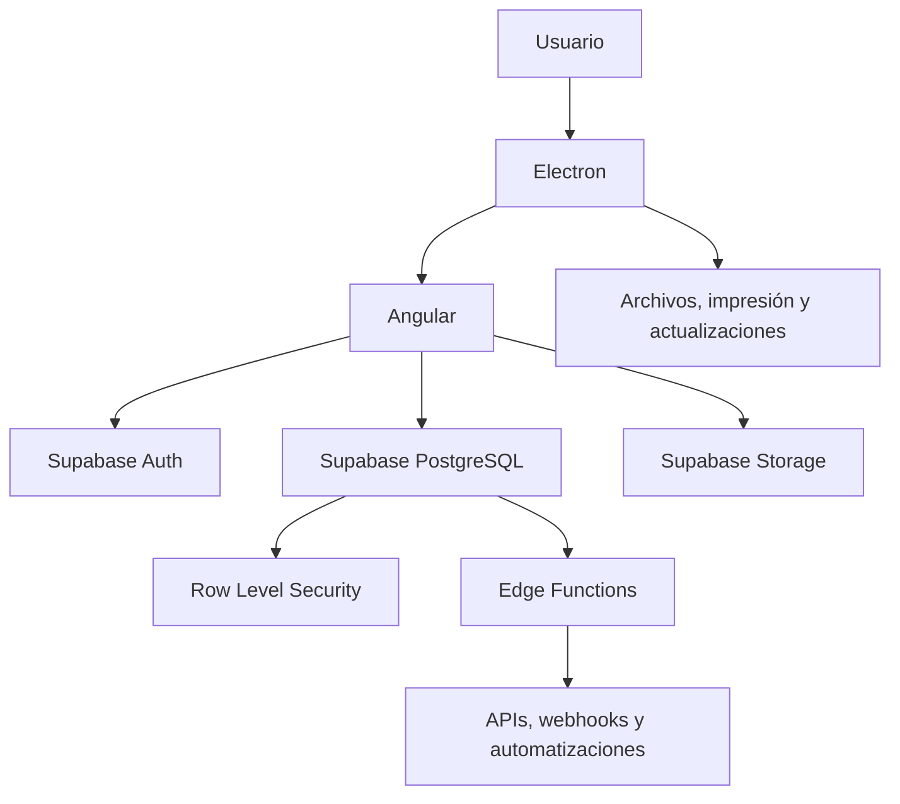
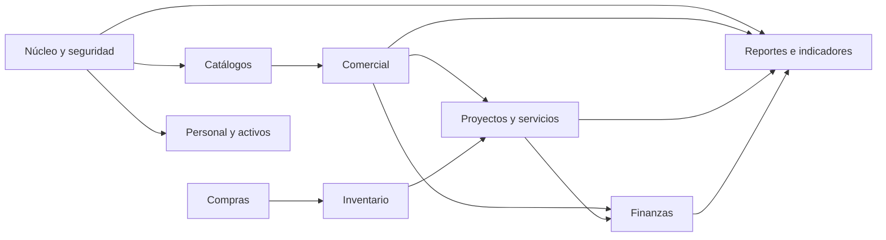

# ERP Desktop

ERP de escritorio modular para gestionar la operación comercial y administrativa de una empresa: clientes, cotizaciones, proyectos, finanzas, compras, inventario, activos y reportes.

El proyecto se organiza con **Screaming Architecture**: la estructura del código expresa los dominios del negocio antes que las tecnologías usadas.

## Objetivos

- Centralizar procesos operativos con permisos, trazabilidad y auditoría.
- Reducir trabajo manual mediante automatizaciones e integraciones.
- Ejecutarse como aplicación de escritorio multiplataforma.
- Mantener un entorno de desarrollo reproducible para todo el equipo.
- Crecer por módulos, sin intentar construir un ERP completo en una primera entrega.

## Arquitectura tecnológica



| Tecnología | Responsabilidad |
| --- | --- |
| Electron | Contenedor de escritorio, acceso nativo a impresión y archivos, actualizaciones y empaquetado. |
| Angular | Interfaz, formularios, navegación, estado y módulos funcionales. |
| Supabase Auth | Inicio de sesión, identidad y gestión de sesiones. |
| Supabase PostgreSQL | Base de datos transaccional y fuente única de datos. |
| Supabase Storage | Documentos, evidencias, comprobantes y archivos adjuntos. |
| Supabase Edge Functions | Reglas sensibles, integraciones y operaciones de backend. |
| Docker Compose | Entorno local consistente y versionado. |
| GitHub Actions | Validación, pruebas, compilación y entregables de Electron. |

> Electron se distribuye como instalador nativo. Docker se utiliza para desarrollo, pruebas e integración; no para ejecutar la aplicación final del usuario.

## Módulos del ERP



| Módulo | Responsabilidades |
| --- | --- |
| Núcleo y seguridad | Empresas, sucursales, usuarios, roles, permisos, sesiones y auditoría. |
| Catálogos | Clientes, proveedores, productos, servicios, impuestos, unidades y configuraciones comunes. |
| Comercial | Prospectos, oportunidades, cotizaciones, órdenes y seguimiento de ventas. |
| Proyectos y servicios | Proyectos, tareas, responsables, horas, entregables y evidencias. |
| Finanzas | Facturas, pagos, gastos y cuentas por cobrar. |
| Compras | Requisiciones, aprobaciones, órdenes de compra y recepción. |
| Inventario | Almacenes, existencias, entradas, salidas, ajustes y mínimos. |
| Personal y activos | Colaboradores, asignación de equipos, licencias e incidencias. |
| Reportes e indicadores | Tableros comercial, operativo y financiero. |
| Automatización e IA | Notificaciones, aprobaciones, webhooks y asistencia supervisada. |

## Reglas de arquitectura

1. Cada módulo es dueño de sus pantallas, reglas de dominio, acceso a datos y rutas.
2. Angular presenta información y aplica validaciones de experiencia; las reglas críticas también se protegen en base de datos o Edge Functions.
3. Todo acceso a datos aplica Row Level Security según empresa, sucursal, rol y módulo.
4. Las migraciones son la única forma de modificar el esquema de producción.
5. Los movimientos financieros, de inventario y permisos generan auditoría.
6. Las llaves y secretos nunca se almacenan en el repositorio.
7. La IA asiste procesos, pero no autoriza movimientos financieros ni sustituye validaciones humanas.

## Estructura del repositorio

```text
apps/
  desktop/                       # Electron: proceso principal, preload y empaquetado
  erp/                           # Aplicación Angular
    src/app/
      core/                      # sesión, seguridad, permisos y navegación
      shared/                    # interfaz y utilidades reutilizables
      features/
        catalogs/
        commercial/
        projects/
        finance/
        purchasing/
        inventory/
        people-assets/
        analytics/

packages/
  domain/                        # entidades, reglas y casos de uso compartidos
  ui/                            # componentes visuales reutilizables
  contracts/                     # tipos, validaciones y contratos de integración

supabase/
  migrations/                    # evolución versionada de PostgreSQL
  functions/                     # Edge Functions
  seed.sql                       # datos de desarrollo

docker/                          # Docker Compose y configuración de desarrollo
docs/
  architecture/                  # diagramas y decisiones técnicas
  decisions/                     # ADRs: decisiones de arquitectura
.github/workflows/               # CI, pruebas, compilación y releases
```

## Estructura interna de cada módulo

```text
features/commercial/
  pages/                         # pantallas de listado, detalle y creación
  components/                    # componentes propios del dominio
  application/                   # casos de uso, por ejemplo crear cotización
  domain/                        # entidades y reglas de negocio
  data-access/                   # repositorios y llamadas a Supabase
  routes.ts                      # rutas y permisos
```

## Seguridad y datos

- Autenticación mediante Supabase Auth.
- Roles mínimos iniciales: administrador, ventas, operación y finanzas.
- Aislamiento de información por empresa y sucursal mediante Row Level Security.
- Auditoría de creación, modificación, eliminación y cambios de estado.
- Archivos protegidos por políticas de Storage, no por URLs públicas permanentes.
- Variables locales en `.env`; secretos de despliegue en GitHub Secrets y Supabase.

## Desarrollo local

Docker Compose y Supabase local deben usar versiones fijadas en archivos versionados. El flujo esperado es:

1. Clonar el repositorio.
2. Copiar `.env.example` a `.env` y completar valores locales.
3. Levantar los servicios locales con Docker Compose.
4. Aplicar migraciones y datos de prueba de Supabase.
5. Ejecutar Angular y Electron en modo desarrollo.

## Integración continua

Cada pull request debe ejecutar:

- Formato y análisis estático.
- Pruebas unitarias y de integración.
- Compilación de Angular y Electron.
- Validación de migraciones de Supabase.
- Revisión de dependencias y secretos expuestos.

Las ramas protegidas requieren revisión antes de integrar cambios. Los instaladores de prueba y las versiones de entrega se generan automáticamente desde GitHub Actions.

## Hoja de ruta

### Fase 1: Base técnica

- Monorepo, Docker, CI y configuración local.
- Electron, Angular y Supabase conectados.
- Autenticación, empresas, usuarios, roles y auditoría.

### Fase 2: Catálogos y comercial

- Clientes, productos y servicios.
- Prospectos, cotizaciones y órdenes.

### Fase 3: Operación y finanzas básicas

- Conversión de órdenes a proyectos.
- Tareas, evidencias, facturas y pagos.

### Fase 4: Abastecimiento e inventario

- Requisiciones, compras, almacenes y movimientos.

### Fase 5: Reportes, automatización e IA

- Indicadores y tableros.
- Notificaciones, integraciones y webhooks.
- Asistencia de IA con supervisión humana.

## Licencia

El proyecto se distribuye bajo una licencia propietaria de código visible. Consultar el archivo `LICENSE` antes de usar, copiar, modificar o distribuir cualquier parte del proyecto.
