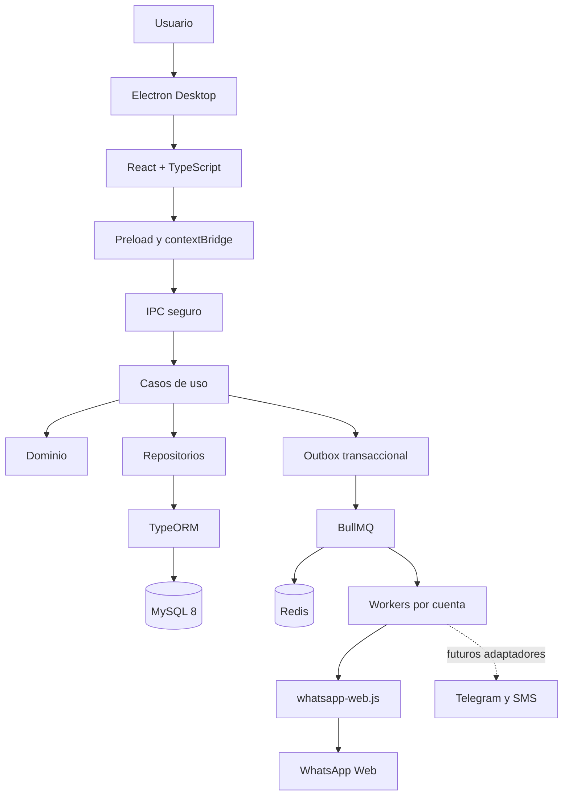
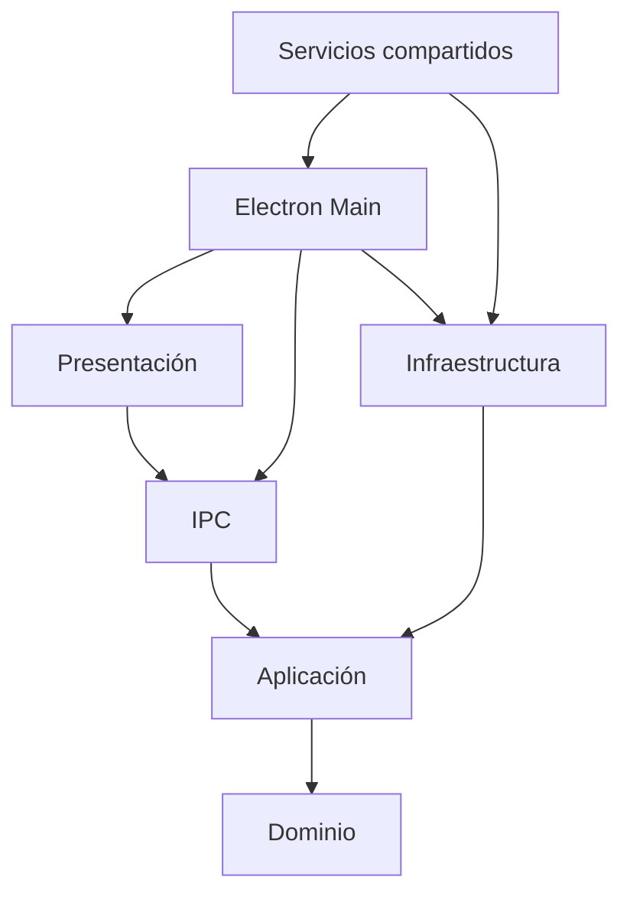
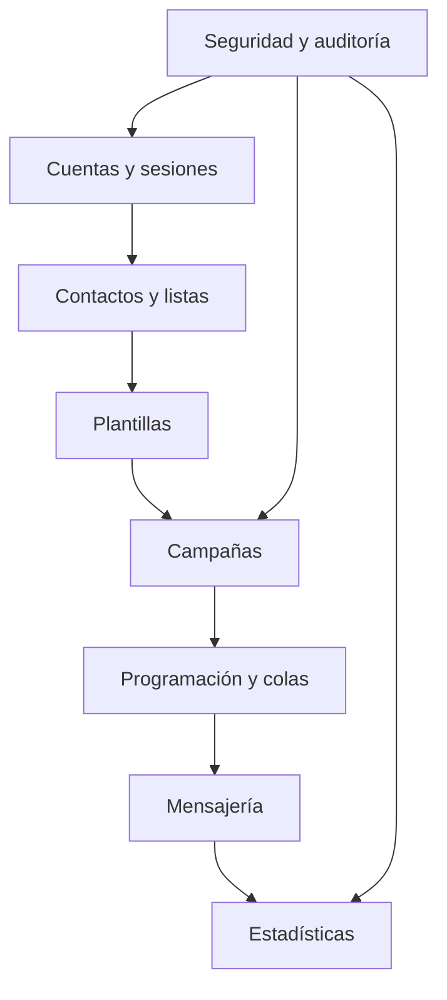
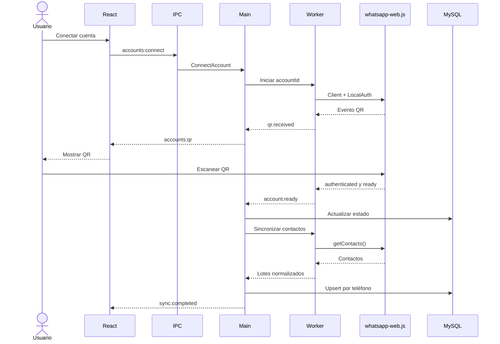

# WhatsApp Campaign CRM Desktop

Aplicación de escritorio modular para crear, programar, ejecutar y medir campañas de marketing por WhatsApp. Permite conectar múltiples cuentas de WhatsApp Business, administrar contactos y listas, personalizar mensajes con variables y consultar estadísticas de envío, entrega y lectura.

El proyecto utiliza **Clean Architecture con Ports and Adapters**. La estructura expresa primero los dominios del negocio —cuentas, contactos, campañas, mensajería y estadísticas— y mantiene Electron, MySQL, TypeORM, Redis y `whatsapp-web.js` como detalles reemplazables de infraestructura.

## Objetivos

- Centralizar cuentas, contactos, listas, plantillas y campañas de WhatsApp.
- Ejecutar envíos personalizados mediante trabajos asíncronos y persistentes.
- Programar campañas y conservar trazabilidad por destinatario.
- Recuperarse de desconexiones, cierres y errores temporales sin duplicar mensajes.
- Proteger el renderer mediante aislamiento de contexto e IPC validado.
- Permitir nuevos canales, como Telegram o SMS, sin modificar el dominio.
- Mantener una base de código modular, testeable y preparada para crecer por cuentas.

## Alcance operativo

La primera versión funciona como una aplicación de escritorio. Electron coordina la interfaz, los casos de uso, la conexión con MySQL y Redis, y los procesos responsables de cada cuenta de WhatsApp.

> Las campañas solo se procesan mientras la aplicación o sus workers estén ejecutándose. Para operación continua 24/7 será necesario mantener la aplicación en segundo plano o trasladar los workers a un servicio siempre encendido.

## Arquitectura tecnológica



| Tecnología | Responsabilidad |
| --- | --- |
| Electron | Contenedor de escritorio, ciclo de vida, IPC, procesos auxiliares, bandeja del sistema, actualizaciones y empaquetado. |
| React + TypeScript | Interfaz, navegación, formularios, campañas, contactos, cuentas y estadísticas. |
| Node.js 18+ | Casos de uso, acceso a datos, colas, sesiones e integración con canales. |
| MySQL 8 | Fuente transaccional de cuentas, contactos, listas, campañas, mensajes, estados y auditoría. |
| TypeORM | Data Mapper, migraciones, repositorios y transacciones. |
| Redis | Persistencia y coordinación de trabajos asíncronos. |
| BullMQ | Colas, programación, rate limiting, reintentos y trabajos fallidos. |
| whatsapp-web.js | Adaptador no oficial para enviar mensajes y recibir eventos de WhatsApp Web. |
| qrcode-terminal | Visualización auxiliar del QR durante desarrollo y diagnóstico. |
| Awilix | Registro e inyección de dependencias en el proceso principal. |
| Zustand | Estado de interfaz y eventos recibidos por IPC. |
| Zod | Validación de contratos IPC, configuración y entradas. |
| Docker Compose | MySQL y Redis reproducibles para desarrollo y pruebas. |
| GitHub Actions | Formato, pruebas, compilación, migraciones y entregables de Electron. |

> `qrcode-terminal` muestra el QR en la consola de desarrollo. En la aplicación instalada, el texto del QR se envía al renderer mediante IPC y se representa dentro de React.

## Capas de la aplicación



| Capa | Responsabilidad |
| --- | --- |
| Dominio | Entidades, objetos de valor, estados, reglas e invariantes sin dependencias de frameworks. |
| Aplicación | Casos de uso y puertos requeridos para repositorios, colas, canales, reloj e identificadores. |
| Infraestructura | Adaptadores de TypeORM, MySQL, BullMQ, Redis, WhatsApp, HTTP y almacenamiento local. |
| Presentación | Componentes React, páginas, hooks, formularios y stores de Zustand. |
| IPC | Contratos, esquemas, handlers y eventos entre renderer y Main. |
| Servicios compartidos | Configuración, logging, errores, validación y utilidades transversales. |
| Electron Main | Composition root: crea ventanas, registra dependencias, inicia servicios y controla el cierre. |

La dirección de dependencias siempre apunta hacia el dominio. El Core no importa Electron, React, TypeORM, BullMQ ni `whatsapp-web.js`.

## Módulos funcionales



| Módulo | Responsabilidades |
| --- | --- |
| Seguridad y auditoría | Usuarios locales, permisos, configuración, acciones sensibles y trazabilidad. |
| Cuentas y sesiones | Alta de cuentas, QR, estados de conexión, reconexión, desvinculación y ownership. |
| Contactos y listas | Contactos, normalización E.164, variables, etiquetas, consentimiento, bajas y listas. |
| Plantillas | Mensajes reutilizables, variables, vista previa y validación. |
| Campañas | Creación, audiencia, cuenta remitente, contenido, programación, pausa y cancelación. |
| Programación y colas | Generación de destinatarios, trabajos diferidos, orden, límites y reintentos. |
| Mensajería | Envío por canal, identificadores externos y eventos de confirmación. |
| Estadísticas | Encolados, enviados, entregados, leídos, fallidos y excluidos. |
| Configuración | MySQL, Redis, límites por cuenta, rutas, logs y comportamiento de segundo plano. |

## Patrones principales

| Patrón | Uso |
| --- | --- |
| Repository | Persistencia de contactos, campañas, mensajes y cuentas mediante puertos del Core. |
| Adapter | `WhatsAppWebJsAdapter` implementa el contrato `ChannelProvider`. |
| Factory | `ChannelProviderFactory` selecciona WhatsApp, Telegram o SMS. |
| Observer | Los eventos de WhatsApp actualizan sesiones, mensajes y renderer. |
| Strategy | Políticas de reintento, rate limiting, personalización y envío por canal. |
| Command | Cada envío se representa como un trabajo persistente. |
| State Machine | Controla estados de cuentas, campañas, destinatarios y mensajes. |
| Unit of Work | Agrupa operaciones TypeORM dentro de una transacción. |
| Transactional Outbox | Evita inconsistencias entre MySQL y Redis. |
| Dependency Injection | Awilix registra adaptadores y permite sustituirlos en pruebas. |
| Idempotency | El identificador del mensaje se reutiliza como identificador del trabajo. |
| Dead Letter Queue | Conserva trabajos que agotaron sus reintentos. |

## Estructura del repositorio

```text
src/
  main/                                # Electron Main y composition root
    index.ts                           # ciclo de vida de Electron
    bootstrap/
      container.ts                     # registro de dependencias con Awilix
      database.ts                      # inicialización y cierre de TypeORM
      queues.ts                        # Redis, productores y consumidores
      workers.ts                       # supervisión de procesos por cuenta
    windows/
      main-window.ts                   # BrowserWindow segura

  core/
    domain/
      accounts/                        # cuentas, sesiones y estados
      contacts/                        # contactos, listas y consentimiento
      templates/                       # plantillas y variables
      campaigns/                       # campañas y destinatarios
      messaging/                       # mensajes y estados
      statistics/                      # métricas del dominio
      events/                          # eventos de dominio
    application/
      use-cases/
        accounts/                      # conectar, reconectar y desvincular
        contacts/                      # crear, importar, listar y excluir
        campaigns/                     # crear, programar, pausar y cancelar
        messaging/                     # enviar y actualizar confirmaciones
      ports/
        repositories/                  # contratos de persistencia
        ChannelProvider.ts             # contrato de canales
        MessageQueue.ts                # contrato de cola
        EventPublisher.ts              # publicación de eventos
        Clock.ts                       # reloj inyectable
        IdGenerator.ts                 # IDs inyectables

  infrastructure/
    database/typeorm/
      data-source.ts
      entities/
      repositories/
      migrations/
    channels/
      ChannelProviderFactory.ts
      whatsapp/
        WhatsAppWebJsAdapter.ts
        WhatsAppClientFactory.ts
        WhatsAppSessionManager.ts
        WhatsAppEventMapper.ts
        LocalAuthPathResolver.ts
      telegram/                        # adaptador futuro
      sms/                             # adaptador futuro
    queues/bullmq/
      BullMessageQueue.ts
      MessageWorker.ts
      OutboxPublisher.ts
      RetryPolicy.ts
      DeadLetterQueue.ts
    http/
      HttpClient.ts                    # clientes para proveedores futuros

  ipc/
    channels.ts                        # lista permitida de canales
    contracts/                         # tipos y esquemas Zod
    handlers/                          # traducción IPC a casos de uso
    register-ipc-handlers.ts

  preload/
    index.ts                           # API mínima expuesta con contextBridge
    global.d.ts                        # tipado de window.crm

  renderer/
    app/                               # router y providers
    features/
      accounts/
      contacts/
      templates/
      campaigns/
      statistics/
      settings/
    components/                        # componentes visuales compartidos
    hooks/                             # consumo de la API IPC
    stores/                            # estado Zustand

  shared/
    config/                            # variables y constantes
    errors/                            # errores normalizados
    logging/                           # logging estructurado
    validation/                        # esquemas comunes
    utilities/

tests/
  unit/                                # Core con repositorios y canales falsos
  integration/                         # TypeORM, MySQL, Redis y colas
  ipc/                                 # contratos y handlers
  e2e/                                 # flujos de Electron

docker/
  docker-compose.yml                   # MySQL 8 y Redis para desarrollo

docs/
  architecture/                        # diagramas y documentación técnica
  decisions/                           # ADRs

.github/workflows/                     # CI, compilación y releases
```

## Reglas de arquitectura

1. El dominio no depende de frameworks ni librerías externas.
2. Los casos de uso dependen únicamente de puertos definidos en el Core.
3. Electron Main registra las implementaciones mediante inyección de dependencias.
4. React nunca accede directamente a Node.js, MySQL, Redis o WhatsApp.
5. `nodeIntegration` permanece desactivado y `contextIsolation` activado.
6. No se utiliza `remote` de Electron.
7. Preload expone funciones específicas; nunca expone `ipcRenderer` completo.
8. Todos los payloads IPC se validan con Zod en el proceso principal.
9. Todo envío pasa por Outbox y BullMQ; ningún componente llama directamente a `sendMessage()`.
10. Una cuenta de WhatsApp tiene un único worker propietario y procesa mensajes en orden.
11. Las migraciones TypeORM son la única forma de modificar el esquema compartido.
12. Los identificadores de mensaje y trabajo son idempotentes para evitar duplicados.
13. Los secretos, sesiones y credenciales nunca se almacenan en Git.
14. Los contactos dados de baja se excluyen antes de generar trabajos.

## Flujo de autenticación y sincronización



## Sesiones de WhatsApp

La primera versión utiliza `LocalAuth`. Cada cuenta se guarda en un directorio independiente bajo la ruta de datos de Electron:

```text
userData/
  whatsapp-sessions/
    session-account-001/
    session-account-002/
  logs/
  cache/
```

MySQL almacena únicamente los metadatos de la cuenta:

- Identificador interno y `clientId`.
- Número y nombre visible.
- Estado actual y última conexión.
- Instancia propietaria y vencimiento del lease.
- Motivo de la última desconexión.

Las sesiones activas no se guardan directamente como columnas convencionales. Para distribución entre máquinas podrá implementarse `RemoteAuth` con un store remoto y cifrado.

## Reconexión

Las cuentas siguen esta máquina de estados:

```text
DISCONNECTED
  -> CONNECTING
  -> QR_REQUIRED
  -> AUTHENTICATED
  -> READY
  -> RECONNECTING
  -> AUTH_REQUIRED
```

- Una pérdida de red pausa la cola de la cuenta y activa reconexión exponencial.
- Una caída de Puppeteer reinicia solamente el worker afectado.
- `auth_failure` cambia la cuenta a `AUTH_REQUIRED` y solicita un nuevo QR.
- La sesión local no se elimina por errores transitorios.
- Cuando la cuenta vuelve a `READY`, se reanuda su cola.
- Los reintentos de reconexión incorporan jitter y un límite máximo de espera.

## Envíos, reintentos y estados

El caso de uso registra primero el mensaje y un evento Outbox dentro de una transacción MySQL. Un publicador mueve posteriormente el evento a BullMQ.

```text
QUEUED -> SENDING -> SENT -> DELIVERED -> READ
                    \-> FAILED
```

Política inicial:

- Cinco intentos por mensaje.
- Backoff exponencial desde cinco segundos.
- Jitter para evitar reintentos simultáneos.
- Concurrencia `1` por cuenta para conservar el orden.
- Rate limit configurable por cuenta y campaña.
- `messageId` como `jobId` para impedir duplicados.
- Errores permanentes pasan directamente a `FAILED`.
- Trabajos agotados pasan a Dead Letter Queue.
- La interfaz permite inspección y reintento manual.

Los errores de red, timeout o navegador no disponible son reintentables. Un número inválido, una baja voluntaria o una plantilla inválida son fallos permanentes.

## Modelo de datos principal

| Tabla | Propósito |
| --- | --- |
| `channel_accounts` | Cuentas, canal, estado, ownership y reconexión. |
| `contacts` | Datos normalizados, variables, consentimiento y baja. |
| `contact_lists` | Listas o segmentos reutilizables. |
| `contact_list_members` | Relación entre contactos y listas. |
| `message_templates` | Plantillas y definición de variables. |
| `campaigns` | Configuración, cuenta, contenido, horario y estado. |
| `campaign_recipients` | Destinatarios y resultado individual. |
| `messages` | Cuerpo final, destino, estado e identificador externo. |
| `message_events` | Historial de encolado, envío, entrega, lectura y error. |
| `outbox_events` | Acciones pendientes de publicación en Redis. |
| `audit_logs` | Acciones administrativas y cambios sensibles. |

## Seguridad

- `nodeIntegration: false`, `contextIsolation: true` y `sandbox: true`.
- API de preload mínima y tipada.
- Lista cerrada de canales IPC.
- Validación Zod en Main, no solamente en React.
- Content Security Policy restrictiva.
- Credenciales de MySQL y Redis protegidas con almacenamiento seguro del sistema operativo cuando corresponda.
- Conexiones remotas mediante TLS y usuarios de privilegios mínimos.
- Sesiones de WhatsApp fuera del repositorio y del directorio de instalación.
- Logs sin QR, cookies, credenciales ni contenido sensible completo.
- Consentimiento, exclusión y límites de frecuencia antes de generar destinatarios.

> Una aplicación distribuida públicamente no debe incluir credenciales administrativas de MySQL o Redis. La conexión directa está pensada para un entorno controlado; una distribución pública requeriría un backend HTTP intermedio.

## Escalabilidad

- Se agregan canales implementando `ChannelProvider` y registrándolos en la Factory.
- Se agregan workers para procesar más cuentas en paralelo.
- Una misma cuenta nunca se ejecuta simultáneamente en dos workers.
- Redis administra el lease y bloqueo por cuenta.
- MySQL conserva el estado transaccional y Redis el trabajo operativo.
- Los adaptadores pueden extraerse posteriormente a servicios sin modificar los casos de uso.

## Desarrollo local

Docker se utiliza para MySQL y Redis durante desarrollo, pruebas e integración. Electron se ejecuta directamente en el sistema anfitrión.

1. Clonar el repositorio.
2. Copiar `.env.example` a `.env`.
3. Levantar MySQL y Redis con Docker Compose.
4. Ejecutar las migraciones TypeORM.
5. Cargar datos de prueba opcionales.
6. Iniciar React y Electron en modo desarrollo.
7. Conectar una cuenta de prueba mediante QR.

Las versiones de MySQL, Redis y Node.js deben estar fijadas en archivos versionados.

## Pruebas

- Pruebas unitarias de entidades y casos de uso sin Electron ni MySQL.
- Repositorios en memoria y canales falsos para el Core.
- Pruebas de integración de TypeORM contra MySQL de desarrollo.
- Pruebas de Outbox, Redis, BullMQ, retries e idempotencia.
- Pruebas de contratos y autorización IPC.
- Pruebas de workers con un `ChannelProvider` simulado.
- Pruebas E2E de los flujos principales de Electron.

## Integración continua

Cada pull request debe ejecutar:

- Formato y análisis estático.
- Pruebas unitarias, de integración e IPC.
- Compilación de React, Main y preload.
- Validación de migraciones TypeORM.
- Auditoría de dependencias y secretos expuestos.
- Empaquetado de prueba de Electron.

Las ramas protegidas requieren revisión antes de integrar cambios. Los instaladores y versiones de entrega se generan desde GitHub Actions.

## Hoja de ruta

### Fase 1: Base técnica

- Electron, React y TypeScript.
- Clean Architecture y contenedor Awilix.
- MySQL, TypeORM, Redis y BullMQ.
- Preload, IPC seguro, logging y configuración.
- CI, migraciones y pruebas base.

### Fase 2: Cuentas y sesiones

- Conexión de una cuenta mediante QR.
- `LocalAuth`, estados y reconexión.
- Worker independiente y supervisión.
- Sincronización inicial de contactos.

### Fase 3: Contactos y plantillas

- CRUD e importación de contactos.
- Listas, etiquetas, variables y bajas.
- Plantillas con vista previa y validación.

### Fase 4: Campañas y colas

- Creación y programación de campañas.
- Personalización por destinatario.
- Outbox, BullMQ, rate limiting y retries.
- Pausa, reanudación y cancelación.

### Fase 5: Estadísticas y operación

- Estados de envío, entrega, lectura y error.
- Dashboard y exportación de resultados.
- Dead Letter Queue y reintento manual.
- Auditoría, permisos y endurecimiento de seguridad.

### Fase 6: Nuevos canales

- Adaptador de Telegram.
- Adaptador de SMS.
- Reglas y límites particulares por proveedor.
- Evaluación de workers siempre encendidos.

## Consideraciones de uso

`whatsapp-web.js` utiliza una integración no oficial. No existe garantía de continuidad o de que una cuenta no sea limitada. El sistema debe aplicar consentimiento, bajas, pausas, límites de frecuencia y supervisión humana. Para operaciones críticas debe evaluarse una API oficial.

## Referencias

- [Electron IPC](https://www.electronjs.org/docs/latest/tutorial/ipc)
- [Electron Security](https://www.electronjs.org/docs/latest/tutorial/security)
- [TypeORM](https://typeorm.io/docs/)
- [BullMQ](https://docs.bullmq.io/)
- [whatsapp-web.js](https://wwebjs.dev/)

## Licencia

El proyecto se distribuye bajo una licencia propietaria de código visible. Consultar el archivo `LICENSE` antes de usar, copiar, modificar o distribuir cualquier parte del proyecto.
